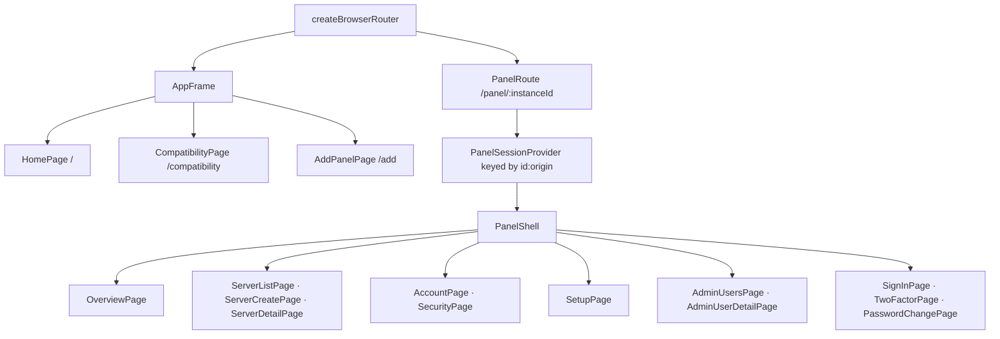
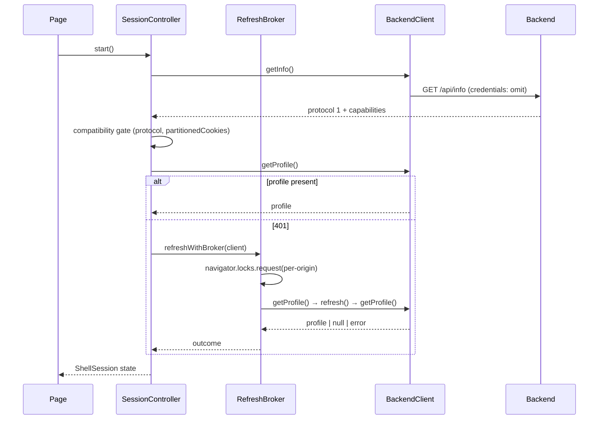

# MinePanel PWA — Architecture

## 1. Scope

How the hosted dashboard (`app.minepanel.xyz`) is built today. Behavioural contracts are in
[`SPEC.md`](./SPEC.md); planning is in [`ROADMAP.md`](./ROADMAP.md). The backend side of every
interface is documented in
[`minepanel-backend/ARCHITECTURE.md`](https://github.com/MinePanelProject/minepanel-backend/blob/master/ARCHITECTURE.md).

This document describes the **current** implementation and therefore tracks the actual client source.
Behavioural requirements, invariants and explicit non-support live in [`SPEC.md`](./SPEC.md), which
also defines how to classify a disagreement between the client and the specification; this file is
corrected when the structure changes, and it must not be used as evidence that a planned feature
exists ([`ROADMAP.md`](./ROADMAP.md) lists intent only).

---

## 2. Stack and shape

| Aspect | Choice |
|--------|--------|
| Framework | React 19 + React Router 7 (data router) |
| Build | Vite 7 + `@vitejs/plugin-react` + `@tailwindcss/vite` |
| Language | TypeScript 5.8, `strict`, `verbatimModuleSyntax`, `@/*` → `src/*` alias |
| Server state | TanStack Query 5 |
| Realtime | `socket.io-client` 4 |
| Persistence | `idb` (IndexedDB) for the panel registry only |
| PWA | `vite-plugin-pwa` (Workbox precache, `registerType: 'prompt'`) |
| Tests | Vitest + jsdom + `fake-indexeddb` |
| Lint | ESLint 9 flat config, zero warnings allowed |
| Hosting | Cloudflare Pages, static output, no runtime |

The app is a single static bundle. There is no SSR, no server runtime, no API route, and no
server-side secret.

---

## 3. Module map

```text
src/
  main.tsx            React root
  app/                router, providers, QueryClient defaults
  api/                backend client, DTO types + validators, error model, query-key factory
  auth/               session controller, Web-Locks refresh broker, panel session provider,
                      cross-tab channel, Google Identity loader
  instances/          strict origin validation, IndexedDB registry, instance context/provider
  realtime/           cookie-first Socket.IO host-metrics hook
  pages/              home, add-panel, compatibility, and the /panel/:instanceId tree
    panel/            overview, account, security, sign-in, two-factor, password change, setup
      servers/        list, create, detail, access section, requestable discovery, pollers
      admin/          user list and user detail
  components/         app frame, panel route, panel shell, metrics panel, Google link control, ui/
  pwa/                service-worker registration and update prompt
  styles/             semantic design tokens and global CSS
public/               _headers (CSP/security/cache), _redirects (SPA fallback), icons, fonts
```

Layering rules that carry architectural weight:

* **`api/` is the only place that performs HTTP.** It owns the fetch policy (`credentials`,
  `cache: 'no-store'`, redirect refusal, `no-referrer`), response validation and error mapping.
* **`auth/` is the only place that mutates session state.** Feature pages consume
  `usePanelSession()`; only auth screens use the internal controller context.
* **`instances/` is the only place that persists anything**, and it persists metadata only.
* **Routes never call `fetch` directly and never construct their own `BackendClient`**; the panel
  route builds one client per panel identity.

---

## 4. Routing and the panel-scoped tree



`PanelRoute` resolves the saved record for `:instanceId`, constructs one `BackendClient` for its
canonical origin, and mounts `PanelSessionProvider` with
`key={`${identity.id}:${identity.origin}`}`.

That `key` is the isolation mechanism: React Router reuses the same route component when navigating
between panels, so remounting on the identity tuple is what guarantees that panel A's controller,
form state (typed passwords, TOTP secrets, backup codes, admin temporary passwords), cached queries
and socket are destroyed before panel B renders. Removing the key would silently leak one panel's
state into another.

`PanelShell` renders the authenticated chrome and, from the session state, exactly one of: a loading
state, the sign-in page (or the setup page on the setup route), the two-factor page, the
password-change page, an approval/ban blocked screen, or an error screen.

---

## 5. Session authority



`SessionController` owns one panel's ephemeral identity and is the only refresh caller. It:

* validates the panel and browser gates before any authenticated request;
* invalidates in-flight restores by operation counter at every terminal boundary, so a late-arriving
  successful profile cannot resurrect a cleared session;
* maps backend machine codes onto explicit shell states — `PasswordChangeRequired`,
  `AccountPending`, `AccountBanned`, `CsrfOriginForbidden`, and the refresh-failure set that means
  the session is expired;
* distinguishes *unavailable* (offline presentation, retryable) from *invalid* (terminal).

`refresh-broker.ts` coalesces refreshes per origin in memory and wraps the network work in a
`navigator.locks` exclusive lock named `minepanel:refresh:<origin>`. Without Web Locks support it
refuses to refresh: strict rotation makes an uncoordinated retry actively destructive, so failing
closed is the correct behaviour.

**Terminal-refresh propagation.** `BackendClient.onSessionTerminal` is a per-client callback invoked
exactly once when a retried authenticated request proves the session terminally invalid. The provider
wires it to the controller, which leaves the authenticated state and runs the panel boundary.
There is no global singleton and no cross-panel coupling.

**Cross-tab advisory.** `session-channel.ts` creates a `BroadcastChannel` named
`minepanel:session:<origin>`. Only server-wide terminations post `'cleared'`. Origin-scoped naming is
what prevents one backend's sign-out-all from clearing a different backend in another tab. If
`BroadcastChannel` is unavailable the channel is `null` and the app still works, with each tab
discovering the termination on its own next request.

---

## 6. Query cache scoping

`api/query-keys.ts` is the single key factory. Every key begins with
`['panel', instanceId, canonicalOrigin]`; user-visible keys then include the authenticated profile id:

```text
['panel', <instanceId>, <origin>, 'user', <profileId>, ...domain]
```

Two properties follow and must be preserved:

1. **Identity isolation.** Sequential users of one panel record cannot read each other's cached rows,
   because the profile id is part of the key.
2. **Boundary cleanup by prefix.** Logout, terminal session failure, panel switch and unmount call
   `cancelQueries` then `removeQueries` on `panelKeys.root(panel)`. The five-minute `gcTime` is never
   the cleanup mechanism at an identity boundary.

Key elements are primitives; no object identity participates.

---

## 7. Backend client and error model

`BackendClient` is constructed per panel origin and enforces the origin rules from
`instances/origin-validation.ts`. It exposes typed methods for the protocol-1 surface and validates
every response with a runtime predicate (`isPanelInfo`, `isAuthProfile`, `isPublicUser`, `isServer`,
`isServerListResponse`, `isSessionRow`, `isMyAccessRequest`, `isSystemStats`) before the value enters
application state.

Failures are normalized into two types:

| Type | Meaning |
|------|---------|
| `BackendClientError` | Transport/shape failure or a deliberate client-side refusal; `kind` distinguishes `unreachable`, `invalid-response`, `unexpected-response`, … |
| `BackendApiError` | The backend answered with a non-OK status; carries the HTTP status and the recognized machine `code` |

`errors.ts` holds the recognized machine-code list, maps status to a coarse kind, and derives
user-facing copy — preferring stable machine-code copy and never surfacing raw backend internals
beyond what the backend itself chose to send as `message`.

**Authorized-request coordinator.** `ensureResponse` resolves a single 401 on a cookie-authenticated
request through the shared refresh broker: a successful rotation replays the original request
**exactly once** (safe because a guard-rejected request never reached a controller), while
`anonymous`/`error` marks the session terminally invalid, fires `onSessionTerminal` once and
rethrows the original 401 without replay.

Endpoints whose 401 is a *semantic* failure rather than a guard rejection MUST opt out with
`refreshOn401 = false` — login, register, 2FA verify, setup init, and refresh itself do so, and the
Google OAuth login/link calls use the raw request path. Feature code must not implement its own retry
or refresh.

---

## 8. Realtime boundary

`realtime/system-stats.ts` is the only socket owner. It connects with `socket.io-client` using
cookies (no bearer token, no ticket), keeps the socket lifetime tied to the
`panelId + origin + profileId` identity tuple, writes received payloads into the panel-scoped query
cache, and exposes a reconnect action plus a connection state for the UI.

Eligibility requires an authenticated non-temporary ADMIN profile on a protocol-1 panel advertising
partitioned cookies with `websocketTicket === false`. Because the hook has no HTTP fallback, socket
data can never become an authority: it is display telemetry only.

---

## 9. PWA and caching boundary

`vite-plugin-pwa` precaches the built same-origin assets (`js`, `css`, `html`, `svg`, `webmanifest`,
`png`, `woff2`). Navigation fallback denies `/api/**` and `/socket.io/**`. No runtime caching rule
exists for backend or Google Identity Services traffic; there is no offline mutation queue and no
background sync.

`public/_headers` splits cache policy by mutability: HTML, manifest and service-worker files
revalidate; hashed `/assets/*` are immutable. The same file carries the CSP and security headers
described in [`SPEC.md`](./SPEC.md) §5.4.

`public/_redirects` provides the SPA fallback (`/* /index.html 200`) required by Cloudflare Pages.

---

## 10. Google Identity boundary

`auth/google-identity.ts` lazily injects the Google Identity Services script and renders the button;
`auth/google-client-id.ts` reads the build-time `VITE_GOOGLE_CLIENT_ID`. The client ID is public by
construction. Google sign-in is offered only when both the panel advertises `googleOAuth` and the
build has a client ID.

Google surfaces satisfy the strict CSP through the two documented exceptions
(`https://accounts.google.com/gsi/client` for scripts and `https://accounts.google.com/gsi/` for
frames), and `connect-src 'self' https: wss:` is what allows the direct browser-to-backend calls to
arbitrary operator origins.

---

## 11. Trust boundaries

| Boundary | Property |
|----------|----------|
| Browser ↔ backend | Direct HTTPS/WSS to an operator origin. The client holds no credential: everything is HttpOnly cookies the backend issues and the browser attaches |
| Cloudflare Pages ↔ browser | Static assets only; no API, no proxy, no credential relay |
| Local device storage | IndexedDB holds panel metadata only; nothing else is persisted |
| Service worker | Application assets only; it never sees auth or API traffic |
| Google Identity | Third-party script/frame, explicitly allow-listed in the CSP; only a short-lived ID token crosses it |
| Cross-tab channel | Origin-scoped, credential-free, advisory only |

The dashboard cannot read session tokens, cannot revoke sessions except by calling the backend's own
logout endpoints, and cannot widen a backend's authorization: every guarded decision is made
server-side.
